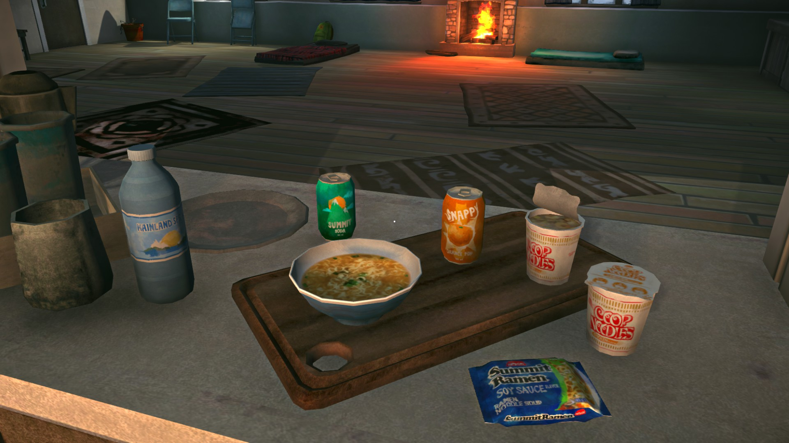
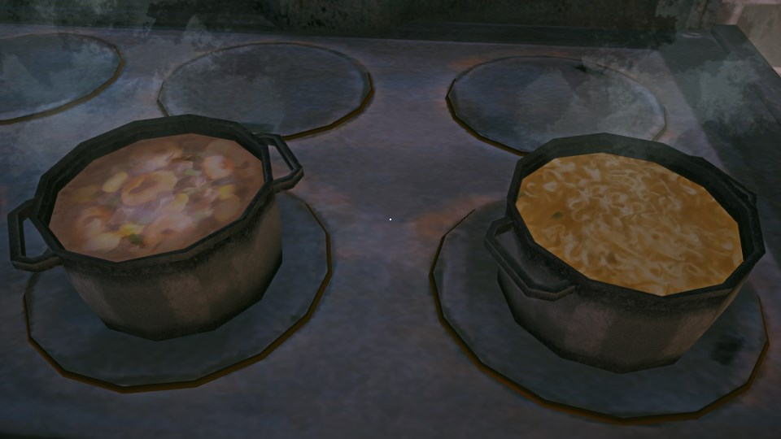
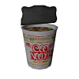
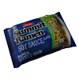
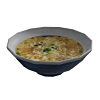

# FoodsBySantana
This is a mod for **The Long Dark** by Hinterland Studio, Inc.
 
 
## Description v1.2
 
Currently, version 1.2 only adds the following food items to the game:
-   Cup Ramen (`add cupnoodles`)
-   Summit Ramen (`add soyramen`)

### Finding Items
Currently the new item will be spawned while searching various locations, that should contain food or drink items, e.g. kitchen cupboards, back packs.
I have also added spawns for all items in various locations. Some of those are guaranteed, others are randomized.

### Adding Food Items
Using the [DeveloperConsole](https://github.com/FINDarkside/TLD-Developer-Console) CupRamen can be manually added to your inventory with the command `add cupnoodles`.
The item is fully integrated into the console and will appear in the auto-complete when pressing tab.

## Installation
* If you haven't done so already, install MelonLoader by downloading and running [MelonLoader.Installer.exe](https://github.com/HerpDerpinstine/MelonLoader/releases/latest/download/MelonLoader.Installer.exe)
* Install the latest version of [ModComponent](https://github.com/ds5678/ModComponent) and its dependencies.
* Download latest version of `FoodsBySantana.zip` from the [releases page](https://github.com/stmSantana/FoodsBySantana/releases/latest).
* Move the two files in the downloaded ZIP to the Mods folder. 
**Note:** Zip files should not be moved to the Mods folder!

## Special Thanks
The Long Dark Modding Server (discord)
